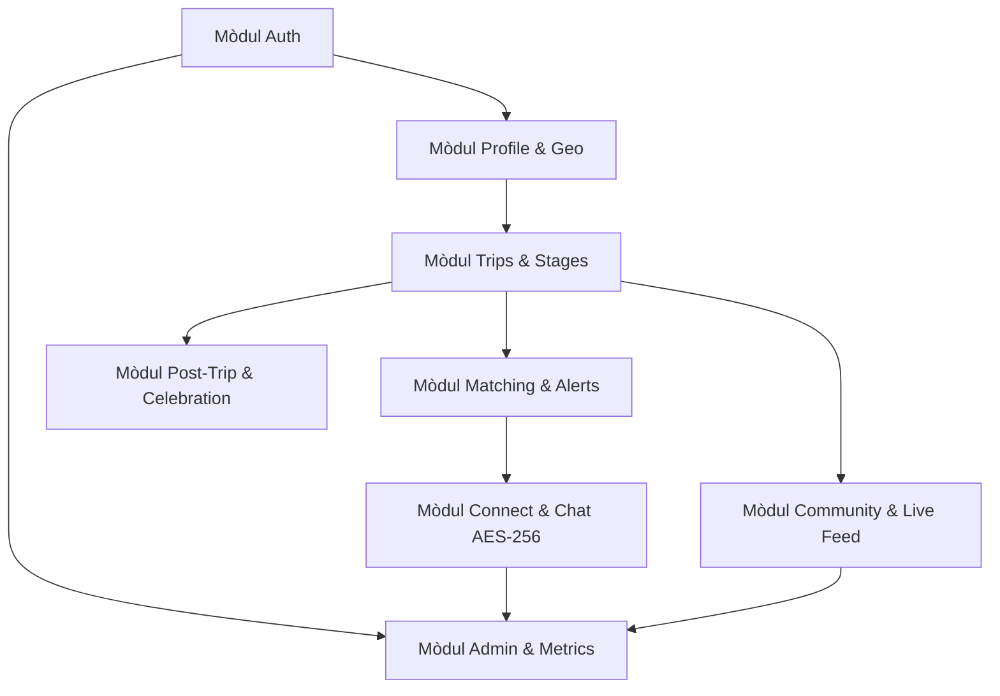

# 📖 Documentació Funcional del Sistema — FELAG

**Versió del document:** 1.0.0  
**Estat del projecte:** Fases 1 a 7 implementades i verificades (Backend Go, Web React, Mobile React Native/Expo)  
**Data d'actualització:** Setembre 2026  

---

## 1. Visió del Producte i Objectius

### 1.1 Missió
**FELAG** és la plataforma comunitària dissenyada per connectar viatgers procedents dels **Països Catalans** (Catalunya, País Valencià, Illes Balears, Catalunya del Nord, Franja de Ponent i Andorra) que coincideixen en dates i destinacions arreu del món.

### 1.2 Proposta de Valor
1. **Connexió per arrels i proximitat:** Facilita trobades a l'estranger basant-se en un motor d'afinitat territorial en 3 nivells (poble, comarca, país).
2. **Privadesa i seguretat sense concessions:** Xat 1 a 1 amb xifratge simètric **AES-256-GCM** a la base de dades, control granular de visibilitat del perfil i de cada viatge, i eines d'autoprotecció (bloqueig i denúncia).
3. **Coneixement compartit (*Community Knowledge*):** Guia col·laborativa de racons, consells pràctics i recomanacions amb filtre especial *"De la meva terra"*.
4. **Experiència completa del viatge:** Des de la planificació d'etapes fins a l'àlbum de fotos del viatge, les *Celebration Cards* de trobades, el ritual de tancament i el reportatge 9:16 per a Stories.

---

## 2. Arquitectura Tècnica i Model de Dades

### 2.1 Plataformes
- **Backend:** Go 1.22+ amb Gin Web Framework, PostgreSQL 15, WebSockets (Gorilla), Argon2id i JWT.
- **Frontend Web:** React 18, TypeScript, Vite, Material UI (MUI v5) amb paleta de colors terra.
- **App Mòbil:** React Native 0.73, Expo 50, React Native Paper, React Native Safe Area Context.

### 2.2 Model Geogràfic Normalitzat
La base de dades conté un catàleg jeràrquic complet de la divisió territorial:
- `countries`: Països i territoris (ex: Catalunya, País Valencià, Illes Balears, Andorra...).
- `regions`: Regions o vegueries administratives.
- `comarcas`: Comarques catalanes i subdivisions comarcals.
- `towns`: Municipis i ciutats amb coordenades geogràfiques i codi postal.

---

## 3. Mòduls Funcionals Detallats

---

### 3.1 Mòdul 1: Autenticació i Gestió d'Usuaris (`/auth`)

#### Funcionalitats clau:
- **Registre d'usuaris:** Validació de correu electrònic únic, contrasenya segura i nom complet.
- **Hashing segur:** Contrasenyes protegides mitjançant l'algorisme criptogràfic **Argon2id**.
- **Autenticació JWT:** Retorn de parella de tokens:
  - `access_token` (curta durada per a peticions a l'API i WebSockets).
  - `refresh_token` (llarga durada per renovació transparent de sessió).
- **Control de rols:** Suport per a rol estàndard (`user`) i rol d'administració (`admin`).

---

### 3.2 Mòdul 2: Perfil d'Usuari i Arrels Territorials (`/profile`)

#### Funcionalitats clau:
- **Assignació d'origen territorial:** L'usuari tria el seu municipi/ciutat mitjançant un selector predictiu connectat a la BD geogràfica (`/api/v1/geo/towns`), assignant automàticament la comarca, regió i país.
- **Nivells de visibilitat del perfil:**
  - `public`: Visible per a tota la comunitat en cerques i coincidències.
  - `contacts_only`: Només visible per a usuaris amb qui s'ha establert connexió/xat.
  - `private`: Perfil invisible en cerques obertes.
- **Idiomes i interessos:** Selecció d'idiomes parlats (català, castellà, anglès, etc.) i estil de viatge (motxiller, natura, cultura, gastronomia).
- **Biografia:** Espai lliure per presentar-se a la comunitat.

---

### 3.3 Mòdul 3: Gestió de Viatges i Etapes (`/trips`)

#### Funcionalitats clau:
- **Creació i edició de viatges:** Títol del viatge, descripció, data d'inici i data de fi.
- **Etapes multiciutat (*Stages*):** Cada viatge es desglossa en etapes ordenades, cadascuna vinculada a un destí (`town_id`), amb dates concretes d'arribada i sortida i notes d'allotjament/plans.
- **Visibilitat per viatge:** Possibilitat de marcar un viatge concret com a `public`, `contacts_only` o `private`.
- **Mode de compartició de fotos (*Photo Sharing Mode*):**
  - `none`: Sense compartició de fotos.
  - `ephemeral_feed`: Participació al feed en viu durant l'estada al destí.
  - `trip_album`: Fotos afegides a l'àlbum col·laboratiu del viatge.

---

### 3.4 Mòdul 4: Motor de Coincidències i Notificacions (`/matching`, `/notifications`)

#### Algorisme de càlcul d'afinitat territorial:
El motor analitza els viatges actius i futurs detectant usuaris que coincideixen en la mateixa ciutat/zona i en les mateixes dates, classificant el grau de coincidència:
1. 🥇 **Nivell Or (Poble / Ciutat):** Ambdós viatgers són del mateix municipi d'origen.
2. 🥈 **Nivell Plata (Comarca):** Ambdós viatgers són de la mateixa comarca.
3. 🥉 **Nivell Bronze (País / Nació):** Ambdós viatgers provenen de l'àmbit territorial compartit.

#### Bústia d'avisos i Notificacions Push:
- Generació automàtica d'un avís quan es detecta una nova coincidència rellevant.
- Registre de tokens de dispositiu (`/api/v1/notifications/push-token`) per a lliurament push mòbil.
- Indicadors visuals de notificacions pendents de llegir (badges numèrics al menú de navegació).

---

### 3.5 Mòdul 5: Connexions, Xat Xifrat i Moderació (`/chats`, `/moderation`)

#### Xat en temps real i seguretat:
- **Protocol WebSockets:** Comunicació bidireccional instantània per a missatges, estats d'escriptura i canvis d'estat de connexió.
- **Xifratge AES-256-GCM en repòs:** Tots els missatges emmagatzemats a la taula `chat_messages` es xifren amb clau simètrica de 256 bits abans de desar-se a PostgreSQL, impedint la lectura no autoritzada a la base de dades.
- **Perfils públics:** Vista segura del perfil de l'interlocutor (`/users/:id`), respectant els ajustos de privadesa configurats per l'usuari.

#### Eines d'autoprotecció i moderació comunitària:
- **Bloqueig d'usuaris:** Possibilitat de bloquejar un usuari en qualsevol moment, tallant immediatament la recepció de missatges i ocultant coincidències futures.
- **Denúncia de continguts (*Reports*):** Formulari integrat per reportar usuaris o missatges per motius de *spam*, contingut inadequat, assetjament o comportament fraudulent.

---

### 3.6 Mòdul 6: Base de Coneixement Comunitari i Moments en Viu (`/community`)

#### Guia de Destinacions i Recomanacions:
- **5 Categories temàtiques:**
  - 🍽️ **Gastronomia:** Restaurants autèntics, plats típics i mercats locals.
  - 💎 **Racons:** Llocs poc coneguts i secrets fora de les rutes turístiques habituals.
  - 🚆 **Transport:** Consells de desplaçament, bitllets i mobilitat econòmica.
  - 💡 **Consells pràctics:** Seguretat, moneda, endolls i recomanacions de viatge.
  - 📖 **Anècdotes:** Experiències singulars viscudes per altres viatgers.
- **Vot d'utilitat (👍 Útil):** Sistema per valorar consells, ordenant les recomanacions per més útils o més recents.
- **Filtre *"De la meva terra"*:** Permet filtrar la guia per mostrar exclusivament consells escrits per viatgers del mateix poble o comarca.
- **Comentaris a les recomanacions:** Espai per formular preguntes o aportar detalls actualitzats a un consell.

#### Feed en Viu (*Live Moments*):
- **Fotos efímeres durant el viatge:** Flux de fotografies recents compartides pels viatgers que estan actualment al destí.
- **Modal d'arribada (*Arrival Prompt*):** Avís automàtic en arribar a una ciutat oferint les opcions de privadesa per compartir moments.

---

### 3.7 Mòdul 7: Experiència Post-Viatge i Exploració Global (`/posttrip`, `/explore`)

#### Hub de Viatge Actiu (*Active Trip Hub*):
- Targeta integrada a la vista principal de viatges que mostra:
  - Etapa actual i dies restants del viatge.
  - Nombre de FELAGIS connectats o propers.
  - Accessos directes a la Celebration Card, Àlbum del viatge, Live Feed i canvi de privadesa.

#### Àlbum de Fotos Col·laboratiu:
- Galeria col·lectiva del viatge on els participants poden carregar fotografies amb peu de foto i ubicació.
- **Fotos destacades (⭐):** Marcades pels viatgers per ser seleccionades automàticament en el reportatge final.

#### *Celebration Cards* de Trobades:
- Generació de targetes commemoratives de trobades entre viatgers a qualsevol part del món (amb títol, fotografia, titular i lloc de la trobada).
- Botó per compartir la targeta directament al xat de la conversa i descàrrega al carret de fotos.

#### Ritual de Tancament (*Trip Wrapup*):
- Procés de 3 passos per concloure el viatge el darrer dia:
  1. Valoració de l'experiència (1 a 5 estrelles ⭐) i comentaris.
  2. Publicació de consells pendents a la guia de la comunitat.
  3. Desbloqueig del reportatge oficial per a xarxes socials.

#### Reportatge 9:16 per a Instagram & TikTok Stories:
- Targeta gràfica vertical d'alta resolució (1080x1920) optimitzada per a Stories, amb estadístiques del viatge (dies, etapes, país, FELAGIS connectats), mosaic de fotos destacades de l'àlbum i botó d'exportació/compartició.

#### Explorador Global de Destinacions (`/explore`):
- Cercador mundial obert per descobrir ciutats populars amb recomanacions organitzades per afinitat de la comunitat.

---

### 3.8 Mòdul 8: Panell d'Administració, Mètriques i Auditoria (`/admin`)

Accés restringit exclusivament a usuaris amb rol `admin` mitjançant el middleware `RequireAdmin()` al backend i protecció de rutes al frontend.

| Pestanya | Objectiu funcional | Indicadors / Dades |
| :--- | :--- | :--- |
| **📊 Comunitat & Negoci** | Mesurar la salut i creixement de la comunitat | Viatges actius, usuaris registrats, distribució de matches (🥇 Poble, 🥈 Comarca, 🥉 País), trobades celebrades, destins top. |
| **⚡ Rendiment API & Salut** | Monitoratge tècnic en temps real | Latències mitjanes, percentils **p95** i **p99**, taula de latència per ruta, ús de RAM (MB), Goroutines actives, pool de connexions PostgreSQL, WebSockets oberts. |
| **📜 Registre d'Auditoria** | Traçabilitat de totes les peticions HTTP | Taula en viu d'accessos generada pel `MetricsMiddleware` asíncron, cercador de text, filtre per mòdul/mètode/estat, paginació i descàrrega de dades en **CSV**. |
| **🛡️ Safata de Moderació** | Gestió de denúncies i resolució | Llistat de denúncies d'usuaris, recomanacions o moments pendents, amb botons d'acció ràpida per **Ignorar** o **Eliminar contingut**. |

---

## 4. Matriu de Cobertura de Proves i Qualitat

Tots els mòduls han estat sotmesos a proves unitàries, comprovació estàtica de tipus i proves d'empaquetat:

- **Backend Go:** 100% dels paquets amb tests automatitzats passant (`go test -count=1 ./...`).
- **Frontend Web:** 0 errors de TypeScript (`tsc --noEmit`), compilació neta amb Vite (`pnpm build`).
- **App Mòbil:** 0 errors de TypeScript (`tsc --noEmit`), exportació de bundle de Metro vàlida (`expo export`).
- **Informes QA & UX:**
  - `qa-reports/connect.md` / `ux-reports/connect.md` (Fase 4 - APTE)
  - `qa-reports/community.md` / `ux-reports/community.md` (Fase 5 - APTE)
  - `qa-reports/post-trip.md` / `ux-reports/post-trip.md` (Fase 6 - APTE)
  - `qa-reports/admin-metrics.md` / `ux-reports/admin-metrics.md` (Fase 7 - APTE)
